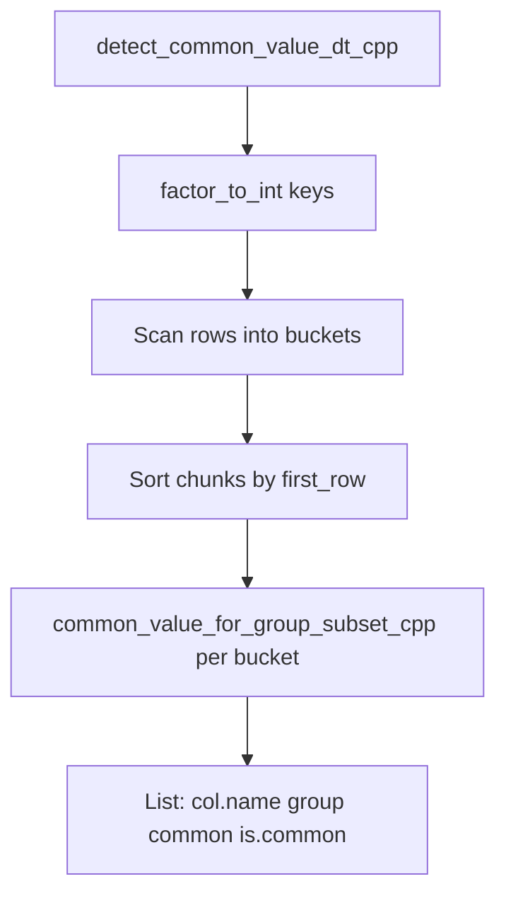

# Explanation: `src/get_common_chunk.cpp`

> Standalone guide to the C++ implementation for [animint/animint2#258](https://github.com/animint/animint2/issues/258).  
> Broader context (issue history, R pipeline, tests): [issue-258-getCommonChunk.md](issue-258-getCommonChunk.md)

**Source file:** `src/get_common_chunk.cpp` (320 lines)  
**Exported function:** `detect_common_value_dt_cpp()`  
**R entry:** `R/RcppExports.R` → `detect_common_value_dt()` in `R/z_animintHelpers.R`  
**R mirror:** `common_value_for_group_subset()` and the inner loop of `detect_common_value_dt()`

---

## Table of contents

1. [What this file does](#1-what-this-file-does)
2. [Where it fits in animint2](#2-where-it-fits-in-animint2)
3. [Why variables are named SEXP](#3-why-variables-are-named-sexp)
4. [Full walkthrough with example](#4-full-walkthrough-with-example)
5. [NA example (PR #242)](#5-na-example-pr-242)
6. [Key helpers and design decisions](#6-key-helpers-and-design-decisions)
7. [R wrapper and return type](#7-r-wrapper-and-return-type)
8. [Line-by-line reference](#8-line-by-line-reference)
9. [C++ → R mapping](#9-c--r-mapping)
10. [Try it in R](#10-try-it-in-r)
11. [References](#11-references)

---

## 1. What this file does

**One sentence:** For every **(column, group)**, it checks whether that column’s values are **identical across all chunk subsets** (e.g. all `showSelected` levels).

This implements **Step 3 only** of `getCommonChunk()` - common-column **detection**. It does **not**:

- Write TSV files
- Run `dcast()` or `split_recursive()`
- Build the varied nested list for `saveChunks()`



---

## 2. Where it fits in animint2

**Problem:** Interactive plots split geom data into multiple chunk TSV files (one per selector value). Often `x`, `y`, `group` repeat across chunks; only `fill` (or similar) changes. Storing shared columns once saves disk and download time.

```
geom1_polygon_chunk_common.tsv  → x, y, group   (written once)
geom1_polygon_chunk1.tsv        → fill, group   (small)
geom1_polygon_chunk2.tsv        → fill, group
```

**Pipeline:**

```
geom-.r
  └─ getCommonChunk(built, chunk.vars, aes.list)     [R/z_animintHelpers.R]
       └─ detect_common_value_dt()
            ├─ detect_common_value_dt_cpp()          ← THIS FILE
            └─ per-column R loop (fallback)
       └─ dcast, split_recursive, varied.chunk       [R - unchanged]
  └─ fwrite *_chunk_common.tsv
  └─ saveChunks() → *_chunkN.tsv

Browser (inst/htmljs/animint.js)
  └─ copy_chunk() merges common + varied TSVs (uses row_in_group for NA paths)
```

---

## 3. Why variables are named SEXP

**SEXP** = **S EXpression** - R’s universal internal type. Every R object (numbers, strings, vectors, data frames) is a `SEXP` pointer in C/C++.

| Name | Meaning |
|------|---------|
| `SEXP x` | A value that came from R (or will go back to R) |
| `is_na_sexp(x)` | “Is this **R scalar** NA?” |
| `equal_sexp(a, b)` | “Are two **R scalars** equal (NA = NA)?” |
| `get_elem(...)` → `SEXP` | One table cell wrapped as a length-1 R object |

**Why not plain `double` / `std::string`?**

- Columns can be numeric, integer, logical, or character
- R’s NA rules differ by type (`NA_real_`, `NA_character_`, …)
- Output `common` column must be valid R list elements
- C++ `==` on `double` does not match R’s `==` with NA

**Analogy:** SEXP is R’s “box” for any value. This file unboxes cells, compares them with R’s rules, then returns results R can consume.

---

## 4. Full walkthrough with example

### Example data

Layer data (after `geom-.r`), simplified polygon-like case:

| row | group | showSelected | x | y | fill |
|-----|-------|--------------|---|---|------|
| 0 | 1 | 1 | 10 | 1 | a |
| 1 | 1 | 1 | 20 | 1 | a |
| 2 | 1 | 2 | 10 | 2 | b |
| 3 | 1 | 2 | 20 | 2 | b |
| 4 | 2 | 1 | 30 | 1 | c |
| 5 | 2 | 1 | 40 | 1 | c |
| 6 | 2 | 2 | 30 | 2 | d |
| 7 | 2 | 2 | 40 | 2 | d |

R call:

```r
detect_common_value_dt_cpp(
  built,
  col_name_vec = c("x", "y", "fill"),
  chunk_vars = "showSelected"
)
```

**Expected detection result:**

| col.name | group | is.common | common       |
|----------|-------|-----------|--------------|
| x | 1 | TRUE | list(10, 20) |
| x | 2 | TRUE | list(30, 40) |
| y | 1 | TRUE | list(1, 2)   |
| y | 2 | TRUE | list(1, 2)   |
| fill | 1 | FALSE | -            |
| fill | 2 | FALSE | -            |

`x` and `y` match across showSelected 1 vs 2; `fill` changes → not common.

---

### Step 1 - Integer keys (`factor_to_int`)

```cpp
group_key = [1, 1, 1, 1, 2, 2, 2, 2]
chunk_key = [1, 1, 2, 2, 1, 1, 2, 2]   // from showSelected
```

Character groups (e.g. `"left"`) are hashed to integers for fast bucketing; original values are restored later via `original_group` and `build_group_output()`.

---

### Step 2 - Scan rows into buckets

Double loop: **each column** × **each row**.

For **column `x`, row 0** (group=1, showSelected=1):

```
PairKey { col=1, group_key=1 }
buckets[key][chunk 1].values ← push Scalar(10)
first_row = 0
original_group[key] ← group scalar 1
```

After full scan for column `x`:

```
(col=x, group=1):
  chunk 1: first_row=0, values [10, 20]
  chunk 2: first_row=2, values [10, 20]

(col=x, group=2):
  chunk 1: first_row=4, values [30, 40]
  chunk 2: first_row=6, values [30, 40]

(col=fill, group=1):
  chunk 1: [a, a]
  chunk 2: [b, b]
  ...
```

This replaces R’s per-column `data.table` grouping with one flat scan + hash maps.

---

### Step 3 - Sort chunks and compare

For bucket `(col=x, group=1)`:

1. Chunk ids: `{1, 2}`
2. Sort by `first_row` (chunk 1 before chunk 2) - matches `setkeyv(built, c("group", chunk.vars))`
3. `chunk_values = [[10,20], [10,20]]`
4. Call `common_value_for_group_subset_cpp` (see below)

---

### Step 4 - Inside `common_value_for_group_subset_cpp` (column x, group 1)

**Input:**

```
chunk showSelected=1:  [10, 20]
chunk showSelected=2:  [10, 20]
```

**Flatten:**

```
lvec      = [2, 2]
value_vec = [10, 20, 10, 20]   // column-major
```

**Matrix (2 rows × 2 chunk columns):**

```
        chunk1  chunk2
row1      10      10
row2      20      20
```

**`min_na_vec`:** first non-NA per row → `[10, 20]`

**Reference:** rows differ → keep vector ref `[10, 20]` (not collapsed to scalar)

**`all_equal_na_rm_matrix`:** every non-NA cell matches its row ref → **`is.common = TRUE`**

**Return:** `list(common = list(c(10, 20)), is.common = TRUE)`

---

For **column fill, group 1:**

```
chunk 1: [a, a]
chunk 2: [b, b]
```

Row 1: `a` vs `b` → mismatch → **`is.common = FALSE`**

---

### Step 5 - Return to R

```r
list(
  col.name  = c("x","x","y","y","fill","fill"),
  group     = c(1,2,1,2,1,2),
  common    = list(...),
  is.common = c(TRUE,TRUE,TRUE,TRUE,FALSE,FALSE)
)
```

`detect_common_value_dt()` wraps with `as.data.table()`. `getCommonChunk()` then writes common TSV with `x`, `y`, `group` and varied chunks with `fill` only.

---

## 5. NA example (PR #242)

| group | showSelected | x | na_group | row_in_group |
|-------|--------------|---|----------|--------------|
| 1 | 1 | NA | 0 | 1 |
| 1 | 1 | 2 | 0 | 2 |
| 1 | 2 | NA | 1 | 1 |
| 1 | 2 | 2 | 0 | 2 |

For column `x`, group 1:

```
chunk 1: [NA, 2]
chunk 2: [NA, 2]
```

NA-tolerant matrix compare:

- row 1: NA vs NA → skip
- row 2: 2 vs 2 → match

→ **`is.common = TRUE`** for `x` (same rules as [PR #242](https://github.com/animint/animint2/pull/242)).

Browser merge uses `row_in_group` in `copy_chunk()` (`inst/htmljs/animint.js`) when varied rows are fewer than common rows.

---

## 6. Key helpers and design decisions

### Helper functions

| Function | Role                                                                                                    |
|----------|---------------------------------------------------------------------------------------------------------|
| `is_na_sexp` / `equal_sexp` | NA-aware comparison of R scalars                                                                        |
| `get_elem(col, i)` | Read one cell as SEXP via `Rf_ScalarReal` / `Rf_ScalarInteger` / `Rf_ScalarLogical` / `Rf_ScalarString` |
| `all_equal_na_rm_matrix` | `all(m == ref, na.rm = TRUE)`                                                                           |
| `first_non_na` | `x[!is.na(x)][1]` per matrix row                                                                        |
| `common_value_for_group_subset_cpp` | Core logic - mirrors R                                                                                  |
| `factor_to_int` | Hash group/chunk columns for bucketing                                                                  |
| `build_group_output` | Output `group` in same type as input                                                                    |
| `detect_common_value_dt_cpp` | Exported entry point                                                                                    |

### Design decisions

1. **Preserve original `group` values** - character groups like `"left"` must not become integer codes in output
2. **Chunk order by `first_row`** - not numeric sort of chunk keys; matches data.table key order
3. **Multi `chunk.vars`** - combined with `\1` separator, then hashed
4. **No file I/O in C++** - detection only; R runs `dcast` and `split_recursive`
5. **`Rf_Scalar*` not `Scalar*`** - required for Windows / R 4.5+ C API

### File structure map

| Lines | Block |
|-------|--------|
| 1–9 | Includes, anonymous namespace |
| 11–66 | Read/compare single R cells (SEXP) |
| 68–102 | Matrix / scalar comparison helpers |
| 104–150 | `common_value_for_group_subset_cpp` |
| 152–226 | Hash keys, data structures, group output |
| 228 | End anonymous namespace |
| 230–319 | `detect_common_value_dt_cpp` |

---

## 7. R wrapper and return type

`R/RcppExports.R`:

```r
detect_common_value_dt_cpp <- function(built, col_name_vec, chunk_vars) {
  .Call(`_animint2_detect_common_value_dt_cpp`, built, col_name_vec, chunk_vars)
}
```

`detect_common_value_dt()` in `R/z_animintHelpers.R`:

```r
if(!is.null(cpp_out)) return(as.data.table(cpp_out))
```

Without `as.data.table()`, `getCommonChunk()` fails at `setkeyv(common_value_dt, "col.name")` with *"x is not a data.table"*.

**Disable C++ (debug):**

```r
options(animint2.use.cpp = FALSE)   # force R per-column path
options(animint2.use.cpp = TRUE)    # restore default
```

---

## 8. Line-by-line reference

### Lines 1–9 - Includes and anonymous namespace

| Line(s) | Code | Explanation |
|---------|------|-------------|
| 1 | `#include <Rcpp.h>` | Rcpp headers: `DataFrame`, `List`, SEXP helpers, `// [[Rcpp::export]]` attribute. |
| 2 | `#include <algorithm>` | `std::sort`, `std::equal` used later for chunk ordering and length checks. |
| 3 | `#include <string>` | `std::string` for column names and multi-chunk key concatenation. |
| 4 | `#include <unordered_map>` | Hash maps for bucketing `(col, group)` → chunk subsets without nested R lists. |
| 5 | `#include <vector>` | Dynamic arrays for values, output columns, chunk ordering. |
| 7 | `using namespace Rcpp;` | Shorter types: `List`, `IntegerVector`, `CharacterVector`, etc. |
| 9 | `namespace {` | Anonymous namespace: all helpers below are **internal** to this translation unit (not exported to R). Only `detect_common_value_dt_cpp` is exported (line 230). |

### Lines 11–24 - `is_na_sexp(SEXP x)`

Tests whether a **length-1 SEXP** (one cell read by `get_elem`) is NA.

| Line(s) | Code | Explanation |
|---------|------|-------------|
| 11 | `inline bool is_na_sexp(SEXP x)` | `inline` for speed; operates on scalar SEXP wrappers. |
| 12 | `switch (TYPEOF(x))` | R SEXP type tag: real, int, logical, string, … |
| 13–14 | `REALSXP` / `ISNA(REAL(x)[0])` | Numeric NA uses R's `ISNA` macro. |
| 15–16 | `INTSXP` / `NA_INTEGER` | Integer NA. |
| 17–18 | `LGLSXP` / `NA_LOGICAL` | Logical NA. |
| 19–20 | `STRSXP` / `NA_STRING` | Character NA (pointer equality to R's NA string). |
| 21–22 | `default: return false` | Other types treated as non-NA for comparison. |

**R equivalent:** `is.na(x)` on a single value.

### Lines 26–51 - `equal_sexp(SEXP a, SEXP b)`

Compares two length-1 SEXP values for equality, with NA matching NA.

| Line(s) | Code | Explanation |
|---------|------|-------------|
| 27–28 | Nil checks | Both `NULL` → equal; one `NULL` → not equal. |
| 29 | `TYPEOF(a) != TYPEOF(b)` | Different types never equal (e.g. `"1"` vs `1`). |
| 31–34 | `REALSXP` | Two NA reals equal; otherwise numeric `==`. |
| 36–39 | `INTSXP` | Integer NA handling. |
| 41–44 | `LGLSXP` | Logical NA handling. |
| 46–47 | `STRSXP` | Compare string pointers (`STRING_ELT`). |
| 48–49 | `default: false` | Unsupported types → not equal. |

### Lines 53–66 - `get_elem(SEXP col, int i)`

Reads row `i` from column vector `col` and returns a **length-1 SEXP** (scalar).

| Line(s) | Code | Explanation |
|---------|------|-------------|
| 54 | `switch (TYPEOF(col))` | Dispatch on storage mode of the column. |
| 55–56 | `Rf_ScalarReal(REAL(col)[i])` | Wrap one double in a SEXP (required `Rf_` prefix on Windows/R 4.5+). |
| 57–58 | `Rf_ScalarInteger` | One integer cell. |
| 59–60 | `Rf_ScalarLogical` | One logical cell. |
| 61–62 | `Rf_ScalarString` | One string cell. |
| 63–64 | `default: R_NilValue` | Unknown column type → NULL scalar. |

### Lines 68–79  `all_equal_na_rm_matrix(...)`

Implements `all(m == min.na.vec, na.rm = TRUE)` from R's matrix branch.

| Line(s) | Code | Explanation |
|---------|------|-------------|
| 68–70 | Parameters | `values`: column-major flattened matrix; `ref`: reference row(s); `group_size`: rows per chunk. |
| 71 | `ref_scalar = ref.size() == 1` | Broadcast single reference to all rows if needed. |
| 72–77 | Loop | Skip NA cells; map index `i` → row `i % group_size`; compare to ref. |
| 78 | `return true` | All non-NA cells matched → common. |

**Column-major layout:** index `row + col * group_size` matches R's `matrix(value.vec, group.size)`.

### Lines 81–86 - `first_non_na(row_values)`

| Line(s) | Code | Explanation |
|---------|------|-------------|
| 81–84 | Loop | First non-NA value across chunk subsets for one matrix row. |
| 85 | Empty / fallback | `R_NilValue` or `row_values[0]`. |

**R equivalent:** `x[!is.na(x)][1]`

### Lines 88–94 - `all_refs_equal(refs)`

**R equivalent:** `length(unique(min.na.vec)) == 1` → collapse to scalar reference.

### Lines 96–102  `all_values_unique_one(values)`

**R equivalent:** `length(unique(value.vec)) == 1` when chunk lengths differ.

### Lines 104–150  `common_value_for_group_subset_cpp(chunk_values)`

Core comparison logic - **direct port** of R's `common_value_for_group_subset()`.

**Input:** `vector<vector<SEXP>>` - one inner vector per chunk subset.

| Line(s) | Code | Explanation |
|---------|------|-------------|
| 105–110 | `lvec`, `value_vec` | Chunk lengths and flattened values. |
| 111 | `std::equal(lvec...)` | Equal lengths → matrix path (PR #242). |
| 116–123 | `min_na_vec` | First non-NA per row across chunks. |
| 124–127 | `ref` | Collapse to scalar if all rows agree. |
| 128 | `all_equal_na_rm_matrix` | NA-tolerant equality → `is.common`. |
| 129–138 | Return | List with `common` and `is.common`. |
| 140–149 | Unequal lengths / not unique | Scalar or empty branches. |

### Lines 152–179 - `factor_to_int(SEXP x)`

Converts group/chunk columns to integer codes for hash-map keys.

### Lines 181–198 - Data structures

| Struct | Purpose |
|--------|---------|
| `PairKey` | `(col index, group_key)` hash key |
| `PairKeyHash` | Hash function for `unordered_map` |
| `ChunkData` | `{ values, first_row }` per chunk subset |

### Lines 200–226 - `build_group_output(groups, template_group)`

Restores `group` column in original storage mode (int, char, etc.).

### Lines 228 - End anonymous namespace

Helpers above are file-local; only `detect_common_value_dt_cpp` is exported.

### Lines 230–253 - Setup and chunk keys

| Line(s) | Code | Explanation |
|---------|------|-------------|
| 230 | `// [[Rcpp::export]]` | Rcpp exports to R. |
| 234–236 | `n`, `group_key` | Row count; integer key for `group`. |
| 238–252 | `chunk_key` | Single or multi `chunk_vars` → integer key per row. |

### Lines 255–275 - Main scan: fill buckets

| Line(s) | Code | Explanation |
|---------|------|-------------|
| 256 | `buckets` | `(col, group)` → chunk → values |
| 257 | `original_group` | First-seen group SEXP for output |
| 259–273 | Double loop | Column × row → `get_elem` → bucket |

### Lines 277–311 - Build output list

| Line(s) | Code | Explanation |
|---------|------|-------------|
| 298–300 | Sort by `first_row` | Match data.table key order |
| 308 | `common_value_for_group_subset_cpp` | Run comparison per bucket |

### Lines 313–319 - Return value

Named list: `col.name`, `group`, `common` (list column), `is.common`.

---

## 9. C++ → R mapping

| C++ | R (`R/z_animintHelpers.R`) |
|-----|----------------------------|
| `common_value_for_group_subset_cpp` | `common_value_for_group_subset()` lines 768–787 |
| `detect_common_value_dt_cpp` | Inner body of `detect_common_value_dt()` lines 816–822 |
| `all_equal_na_rm_matrix` | `all(m == min.na.vec, na.rm=TRUE)` line 780 |
| `first_non_na` | `x[!is.na(x)][1]` line 774 |
| `factor_to_int` | Implicit in data.table `by = chunk.cols` grouping |
| `build_group_output` | R keeps native `group` from `by = group` |

---

## 10. Try it in R

```r
library(devtools)
load_all()
library(data.table)

built <- data.table(
  group = rep(1:2, each = 4),
  showSelected = rep(c(1, 1, 2, 2), 2),
  x = rep(c(10, 20), each = 4),
  y = rep(c(1, 2), each = 4),
  fill = c("a", "a", "b", "b", "c", "c", "d", "d")
)
setkeyv(built, c("group", "showSelected"))

# C++ detection table
cpp <- animint2:::detect_common_value_dt(built, c("x", "y", "fill"), "showSelected")
print(cpp[, .(col.name, group, is.common)])

# Full common/varied split
result <- animint2:::getCommonChunk(built, "showSelected", list(group = "group"))
names(result$common)   # "x", "y", "group"
result$varied          # nested list with fill per chunk
```

**Unit tests:**

```r
testthat::test_file("tests/testthat/test-compiler-getCommonChunk.R")
```

---

## 11. References

| Source | Relevance |
|--------|-----------|
| `src/get_common_chunk.cpp` | This file |
| `R/z_animintHelpers.R` | R functions mirrored by C++ |
| `R/geom-.r` | Calls `getCommonChunk()`; creates `na_group` / `row_in_group` |
| `R/RcppExports.R` | R wrapper for `.Call` |
| `src/RcppExports.cpp` | Auto-generated registration |
| `inst/htmljs/animint.js` | `copy_chunk()` browser merge |
| [Issue #258](https://github.com/animint/animint2/issues/258) | Motivation for C++ port |
| [PR #238](https://github.com/animint/animint2/pull/238) | Original vectorization / speed |
| [PR #242](https://github.com/animint/animint2/pull/242) | NA matrix comparison rules |
| [PR #255](https://github.com/animint/animint2/pull/255) | Single common column, `group=1` |
| `tests/testthat/test-compiler-getCommonChunk.R` | Unit tests including C++ vs R agreement |
| [issue-258-getCommonChunk.md](issue-258-getCommonChunk.md) | Full issue documentation |
